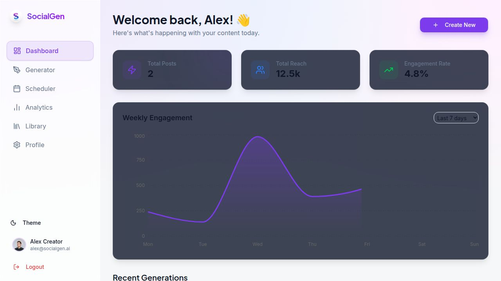

# 🚀 SocialGen AI - Social Media Content Platform

<div align="center">



**AI-Powered Social Media Content Generation Platform**

[](https://reactjs.org/)
[](https://www.typescriptlang.org/)
[](https://vitejs.dev/)
[](https://tailwindcss.com/)

Create engaging social media content in seconds with AI-powered tools ✨

[Demo](#-demo) • [Features](#-features) • [Quick Start](#-quick-start) • [Tech Stack](#-tech-stack)

</div>

---

## 📋 Table of Contents

- [Overview](#-overview)
- [Features](#-features)
- [Demo](#-demo)
- [Quick Start](#-quick-start)
- [Tech Stack](#-tech-stack)
- [Project Structure](#-project-structure)
- [Usage Guide](#-usage-guide)
- [Contributing](#-contributing)
- [License](#-license)

---

## 🌟 Overview

**SocialGen AI** is a modern, fully client-side social media content generation platform that helps content creators, marketers, and businesses create engaging posts for multiple platforms including Instagram, LinkedIn, Twitter, Facebook, and YouTube.

### Why SocialGen AI?

- 🎯 **No Backend Required** - Everything runs in your browser using localStorage
- 🔒 **Privacy First** - Your data never leaves your device
- ⚡ **Lightning Fast** - No server calls, instant responses
- 🎨 **Beautiful UI** - Modern glassmorphic design with light/dark themes
- 📱 **Fully Responsive** - Works perfectly on all devices

---

## ✨ Features

### 🤖 AI Content Generation
- **Text-to-Post**: Generate engaging content from topic descriptions
- **Image-to-Caption**: Upload images and get AI-generated captions
- **Multi-Platform Support**: Instagram, LinkedIn, Twitter, Facebook, YouTube
- **Custom Tones**: Professional, Casual, Funny, Motivational
- **Multi-Language**: Generate content in multiple languages

### 📊 Analytics & Insights
- **Performance Dashboard**: Track your content performance
- **Engagement Metrics**: Monitor reach and engagement rates
- **Platform Distribution**: Visualize content across platforms
- **Trend Analysis**: Identify what works best

### 📅 Content Scheduling
- **Calendar View**: Visualize your content schedule
- **Scheduled Posts**: Plan your content in advance
- **Status Tracking**: Draft, Scheduled, Posted statuses

### 🎨 Modern UI/UX
- **Glassmorphic Design**: Beautiful frosted glass effects
- **Dark/Light Themes**: Toggle between themes seamlessly
- **Smooth Animations**: Delightful micro-interactions
- **Responsive Layout**: Mobile-first design approach

### 🔐 Authentication
- **Demo Mode**: No signup required, instant access
- **Cookie-Based Sessions**: Persistent login state
- **Protected Routes**: Secure page navigation
- **Toast Notifications**: Real-time feedback (3s auto-close)

---

## 🎬 Demo

### Light Theme


### Dark Theme


### Live Demo
Try it out: [SocialGen AI Demo](#) *(Coming Soon)*

---

## 🚀 Quick Start

### Prerequisites

Make sure you have one of these installed:
- **Node.js** (v18 or higher)
- **Bun** (recommended for faster installation)

### Installation

1. **Clone the repository**
```bash
git clone https://github.com/yourusername/AI-Social-Hub.git
cd AI-Social-Hub
```

2. **Install dependencies**
```bash
# Using bun (recommended)
bun install

# Or using npm
npm install
```

3. **Start the development server**
```bash
# Using bun
bun run dev

# Or using npm
npm run dev
```

4. **Open your browser**
```
http://localhost:3000
```

### First Time Setup

1. You'll see the login page with a disclaimer
2. Enter **any email and password** (e.g., `demo@socialgen.ai` / `password123`)
3. Click "Sign in" and you're in! 🎉

---

## 🛠️ Tech Stack

### Frontend Framework
- **React 19.2** - Latest React with modern features
- **TypeScript 5.6** - Type-safe development
- **Vite 7.1** - Lightning-fast build tool

### UI & Styling
- **Tailwind CSS 4.1** - Utility-first CSS framework
- **Radix UI** - Accessible component primitives
- **Framer Motion** - Smooth animations
- **Recharts** - Beautiful data visualizations

### State Management
- **Zustand** - Lightweight state management
- **React Hook Form** - Performant forms

### Routing & Navigation
- **Wouter** - Minimalist router (1KB!)

### Storage & Data
- **localStorage** - Browser-based persistence
- **Cookies** - Session management

### Developer Experience
- **ESLint** - Code linting
- **PostCSS** - CSS processing
- **Autoprefixer** - Vendor prefixing

---

## 📁 Project Structure

```
AI-Social-Hub/
├── client/                   # Frontend application
│   ├── src/
│   │   ├── components/      # React components
│   │   │   ├── ui/         # Reusable UI components
│   │   │   ├── Layout.tsx   # Main layout wrapper
│   │   │   ├── ProtectedRoute.tsx
│   │   │   └── ...
│   │   ├── pages/          # Page components
│   │   │   ├── Login.tsx
│   │   │   ├── Dashboard.tsx
│   │   │   ├── Generator.tsx
│   │   │   ├── Scheduler.tsx
│   │   │   └── Analytics.tsx
│   │   ├── lib/            # Utilities
│   │   │   ├── auth.ts     # Authentication logic
│   │   │   └── utils.ts
│   │   ├── store/          # State management
│   │   │   └── useStore.ts
│   │   ├── hooks/          # Custom hooks
│   │   ├── App.tsx         # Main app component
│   │   ├── main.tsx        # Entry point
│   │   └── index.css       # Global styles
│   ├── public/             # Static assets
│   └── index.html          # HTML template
├── package.json            # Dependencies
├── vite.config.ts          # Vite configuration
├── tsconfig.json           # TypeScript config
├── tailwind.config.js      # Tailwind config
└── README.md              # This file!
```

---

## 📖 Usage Guide

### 1. Login
- Enter any email and password (demo mode)
- Authentication persists across sessions via cookies

### 2. Dashboard
- View your content statistics
- See engagement trends
- Quick access to recent posts

### 3. Content Generator
**Text-to-Post:**
1. Select platform (Instagram, LinkedIn, etc.)
2. Choose content type (Post, Reel, Story, etc.)
3. Pick a tone (Professional, Casual, Funny, Motivational)
4. Enter your topic/prompt
5. Click "Generate Content"
6. Get AI-generated content with hashtags!

**Image-to-Caption:**
1. Switch to "Image to Caption" tab
2. Upload an image
3. AI analyzes and generates a caption
4. Edit and customize as needed

### 4. Scheduler
- View calendar with scheduled posts
- Click dates to see posts for that day
- Track post statuses (Draft, Scheduled, Posted)

### 5. Analytics
- Platform distribution pie chart
- Content tone bar chart
- Performance metrics

### 6. Theme Toggle
- Click the moon/sun icon to switch themes
- Preference saved to localStorage

---

## 🎨 Customization

### Change Theme Colors

Edit `client/src/index.css`:

```css
@theme inline {
  --color-primary: hsl(262 83% 58%); /* Change primary color */
  /* ... other colors */
}
```

### Add New Platforms

Update `client/src/store/useStore.ts`:

```typescript
export type Platform = 'Instagram' | 'Facebook' | 'LinkedIn' | 'Twitter' | 'YouTube' | 'YourPlatform';
```

### Customize Content Generation

Modify the `generateContent` function in `client/src/store/useStore.ts` to integrate with real AI APIs.

---

## 🔧 Available Scripts

```bash
# Development
bun run dev          # Start dev server on port 3000

# Build
bun run build        # Build for production

# Preview
bun run preview      # Preview production build

# Type Check
bun run check        # Run TypeScript type checking
```

---

## 📦 Build & Deploy

### Production Build

```bash
bun run build
```

This creates an optimized build in the `dist/` folder.

### Deploy Options

**Vercel** (Recommended)
```bash
vercel deploy
```

**Netlify**
```bash
netlify deploy --prod
```

**GitHub Pages**
```bash
# Build and deploy to gh-pages branch
npm run build
# Follow GitHub Pages setup
```

---

## 🤝 Contributing

Contributions are welcome! Please follow these steps:

1. Fork the repository
2. Create a feature branch (`git checkout -b feature/AmazingFeature`)
3. Commit your changes (`git commit -m 'Add some AmazingFeature'`)
4. Push to the branch (`git push origin feature/AmazingFeature`)
5. Open a Pull Request

---

## 📄 License

This project is licensed under the **MIT License** - see the [LICENSE](LICENSE) file for details.

---

## 🙏 Acknowledgments

- **Radix UI** for accessible components
- **Tailwind CSS** for the amazing utility framework
- **Lucide React** for beautiful icons
- **Recharts** for data visualization
- **Zustand** for state management

---

## 💬 Support

Need help? Have questions?

- 📧 Email: support@socialgen.ai
- 💬 Discord: [Join our community](#)
- 🐦 Twitter: [@SocialGenAI](#)
- 📝 Issues: [GitHub Issues](https://github.com/yourusername/AI-Social-Hub/issues)

---

## 🗺️ Roadmap

- [ ] Real AI API integration (OpenAI, Anthropic)
- [ ] Export content to PDF/Images
- [ ] Bulk content generation
- [ ] Team collaboration features
- [ ] Content templates library
- [ ] Browser extension
- [ ] Mobile app (React Native)

---

<div align="center">

**Made with ❤️ by the SocialGen AI Team**

⭐ Star us on GitHub — it motivates us a lot!

[Website](#) • [Documentation](#) • [Blog](#) • [Twitter](#)

</div>


